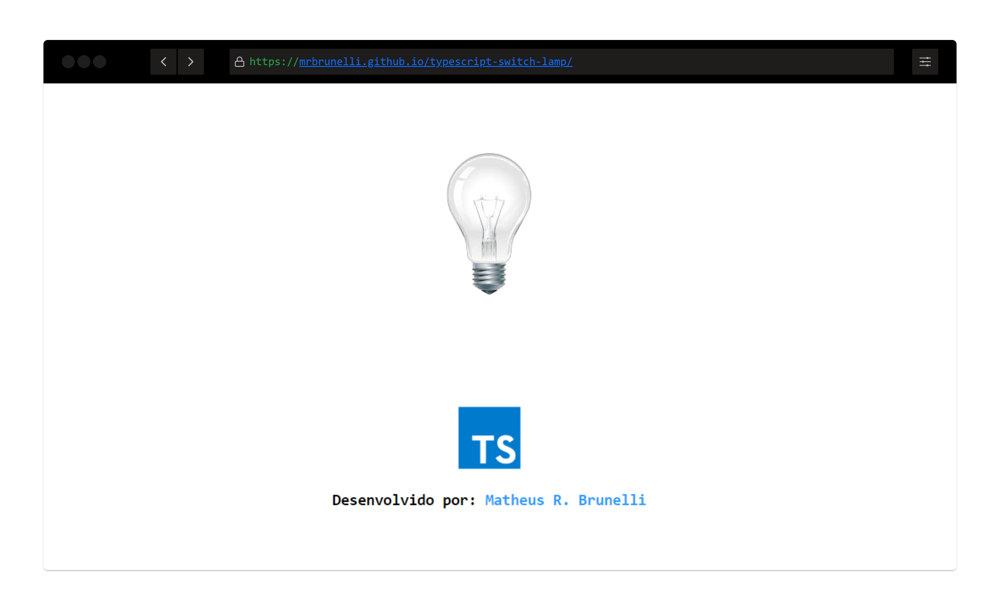

<div align="center">
    
</div>

#### Typescript Lamp :bulb:
> Utilização de Classe para manipular a árvore de elementos do HTML.

Todo o código Typescript deve ser compilado para Javascript antes de executar o arquivo
```typescript
tsc script.ts
```